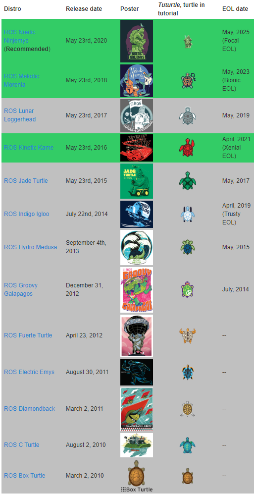
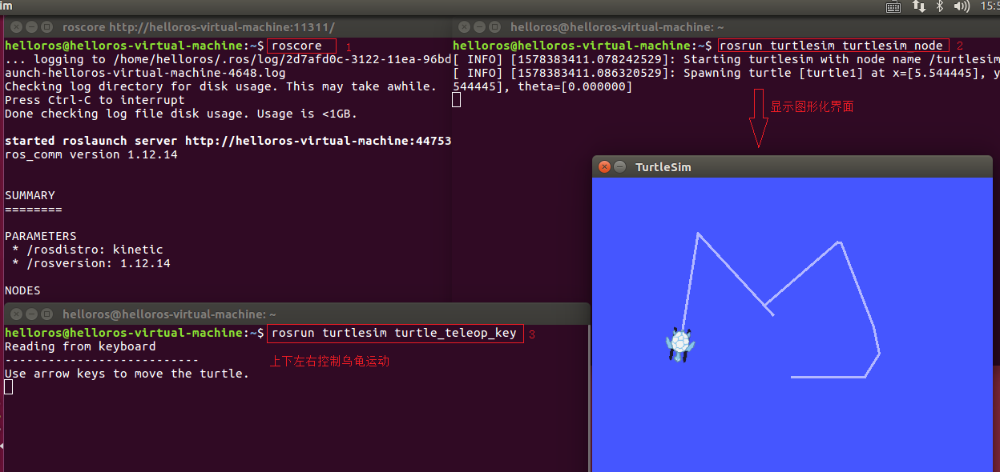
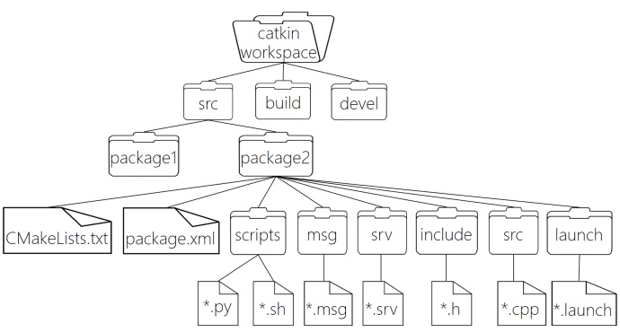
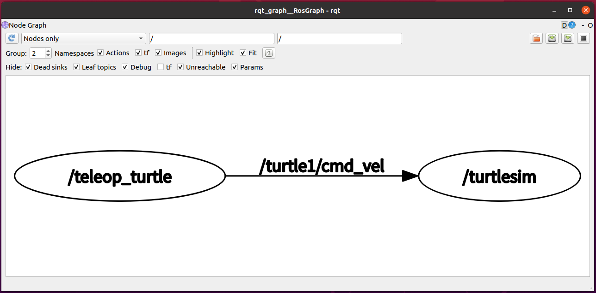
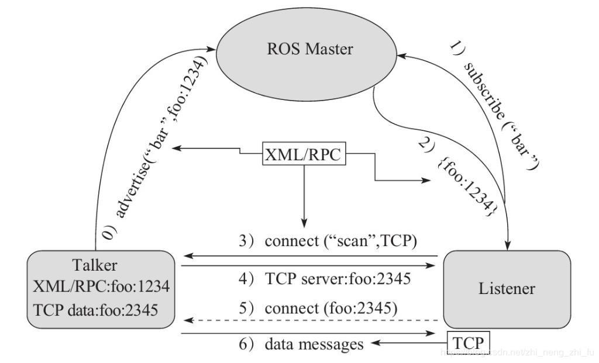
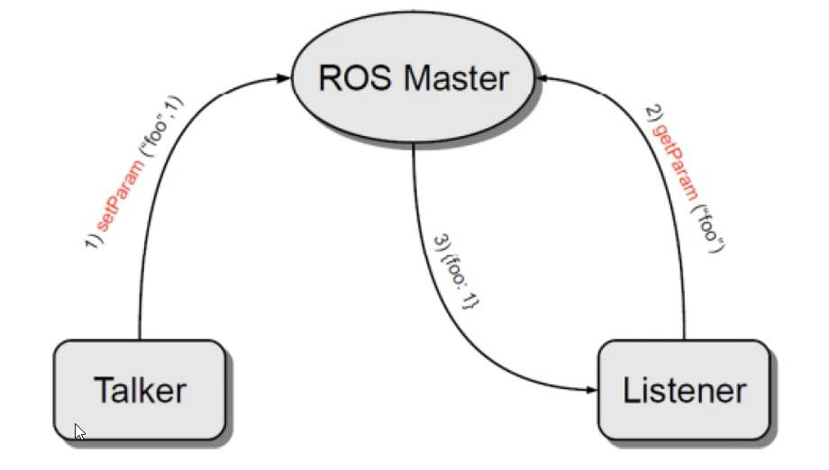
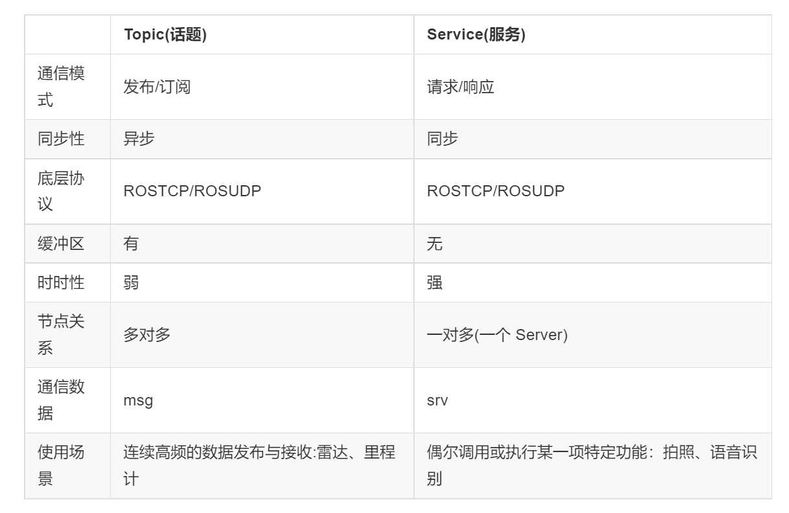
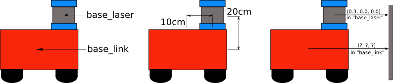
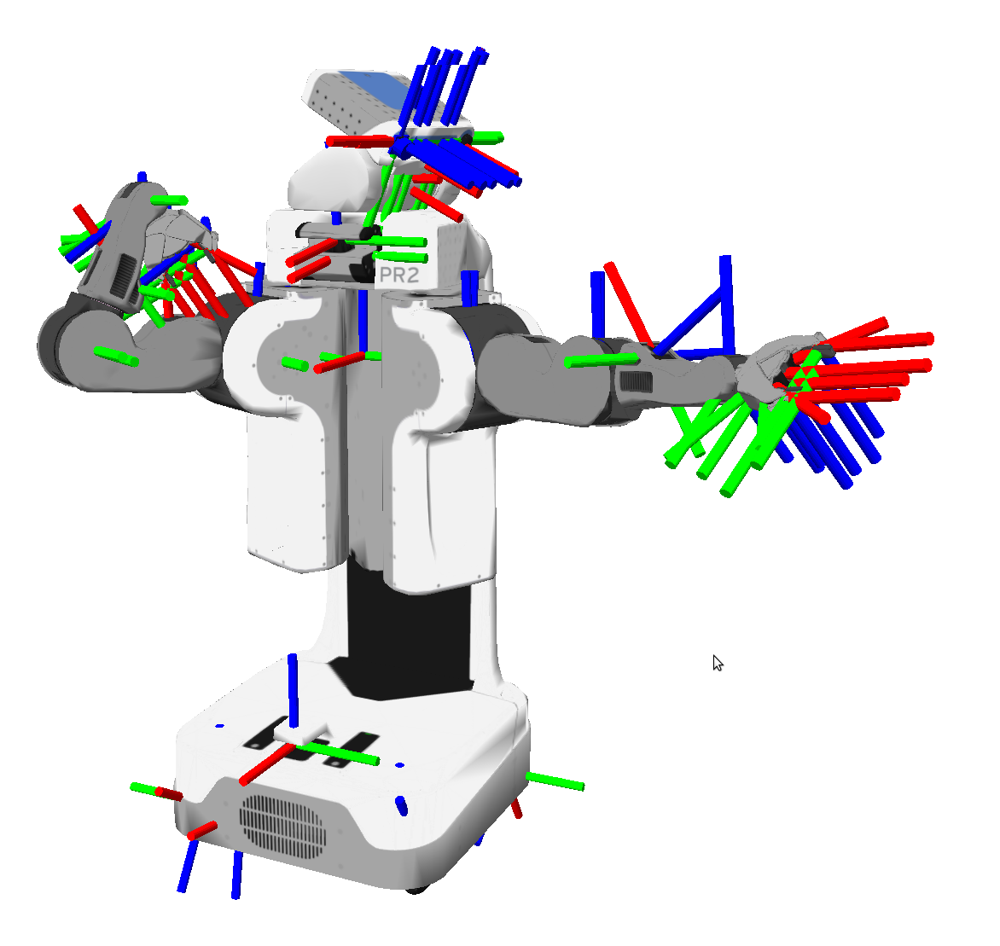
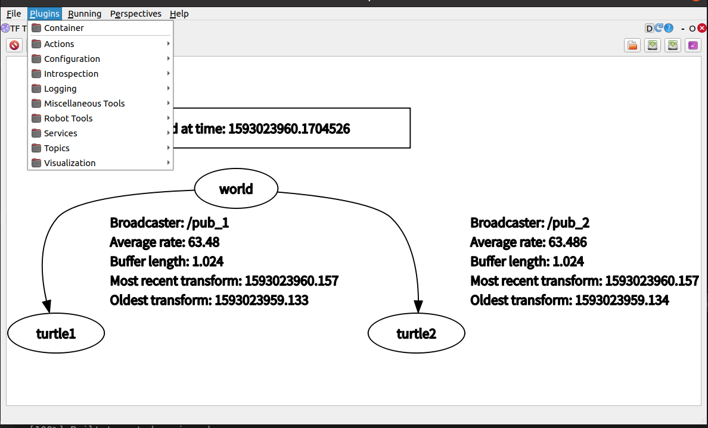

==因项目需要学习ros，并丰强化自己python&c++的编程能力==

# ROS基础

## ROS设计目标

- 机器人开发的分工思想，实现了不同研发团队间的共享和协作，提升了机器人的研发效率，为了服务“ 分工”，ROS主要设计了如下目标：

- **代码复用**:ROS的目标不是成为具有最多功能的框架，ROS的主要目标是支持机器人技术研发中的代码重用。

- **分布式**:ROS是进程（也称为Nodes）的分布式框架,ROS中的进程可分布于不同主机，不同主机协同工作，从而分散计算压力

- **松耦合**:ROS中功能模块封装于独立的功能包或元功能包，便于分享，功能包内的模块以节点为单位运行，以ROS标准的IO作为接口，开发者不需要关注模块内部实现，只要了解接口规则就能实现复用,实现了模块间点对点的松耦合连接

- **精简**：ROS被设计为尽可能精简，以便为ROS编写的代码可以与其他机器人软件框架一起使用。ROS易于与其他机器人软件框架集成：ROS已与OpenRAVE，Orocos和Player集成。

- **语言独立性**：包括Java，C++，Python等。为了支持更多应用开发和移植，ROS设计为一种语言弱相关的框架结构，使用简洁，中立的定义语言描述模块间的消息接口，在编译中再产生所使用语言的目标文件，为消息交互提供支持，同时允许消息接口的嵌套使用

- **易于测试**：ROS具有称为rostest的内置单元/集成测试框架，可轻松安装和拆卸测试工具。

- **大型应用**：ROS适用于大型运行时系统和大型开发流程。

- **丰富的组件化工具包**：ROS可采用组件化方式集成一些工具和软件到系统中并作为一个组件直接使用，如RVIZ（3D可视化工具），开发者根据ROS定义的接口在其中显示机器人模型等，组件还包括仿真环境和消息查看工具等

- **免费且开源**：开发者众多，功能包多

***

## ROS发展历程

- ROS是一个由来已久、贡献者众多的大型软件项目。在ROS诞生之前，很多学者认为，机器人研究需要一个开放式的协作框架，并且已经有不少类似的项目致力于实现这样的框架。在这些工作中，斯坦福大学在2000年年中开展了一系列相关研究项目，如斯坦福人工智能机器人（STandford AI Robot, STAIR）项目、个人机器人（Personal Robots, PR）项目等，在上述项目中，在研究具有代表性、集成式人工智能系统的过程中，创立了用于室内场景的高灵活性、动态软件系统，其可以用于机器人学研究。

- 2007年，柳树车库（Willow Garage）提供了大量资源，用于将斯坦福大学机器人项目中的软件系统进行扩展与完善，同时，在无数研究人员的共同努力下，ROS的核心思想和基本软件包逐渐得到完善。

- ROS的发行版本（ROS distribution）指ROS软件包的版本，其与Linux的发行版本（如Ubuntu）的概念类似。推出ROS发行版本的目的在于使开发人员可以使用相对稳定的代码库，直到其准备好将所有内容进行版本升级为止。因此，每个发行版本推出后，ROS开发者通常仅对这一版本的bug进行修复，同时提供少量针对核心软件包的改进。

- 版本特点: 按照英文字母顺序命名，ROS 目前已经发布了ROS1 的终极版本: noetic，并建议后期过渡至 ROS2 版本。noetic 版本之前默认使用的是 Python2，noetic 支持 Python3。

- 建议版本: noetic 或 melodic 或 kinetic



***

## ROS快速体验

**安装：**无科学上网推荐鱼香

**测试 ROS**

1. ROS 内置了一些小程序，可以通过运行这些小程序以检测 ROS 环境是否可以正常运行

2. 首先启动三个命令行(ctrl + alt + T)

3. 命令行1键入:roscore

4. 命令行2键入:rosrun turtlesim turtlesim_node(此时会弹出图形化界面)

5. 命令行3键入:rosrun turtlesim turtle_teleop_key(在3中可以通过上下左右控制2中乌龟的运动)

最终结果如下所示:



**HelloWorld实现简介**
ROS中涉及的编程语言以C++和Python为主，ROS中的大多数程序两者都可以实现，在本系列教程中，每一个案例也都会分别使用C++和Python两种方案演示，大家可以根据自身情况选择合适的实现方案。

ROS中的程序即便使用不同的编程语言，实现流程也大致类似，以当前HelloWorld程序为例，实现流程大致如下：

先创建一个工作空间；
再创建一个功能包；
编辑源文件；
编辑配置文件；
编译并执行。
上述流程中，C++和Python只是在步骤3和步骤4的实现细节上存在差异，其他流程基本一致。本节先实现C++和Python程序编写的通用部分步骤1与步骤2，1.3.2节和1.3.3节再分别使用C++和Python编写HelloWorld。

1.创建工作空间并初始化
`mkdir -p 自定义空间名称/src`
`cd 自定义空间名称`
`catkin_make`

上述命令，首先会创建一个工作空间以及一个 src 子目录，然后再进入工作空间调用 catkin_make命令编译。

2.进入 src 创建 ros 包并添加依赖
`cd src`
`catkin_create_pkg 自定义ROS包名 roscpp rospy std_msgs`

<br/>

上述命令，会在工作空间下生成一个功能包，该功能包依赖于 roscpp、rospy 与 std_msgs，其中roscpp是使用C++实现的库，而rospy则是使用python实现的库，std_msgs是标准消息库，创建ROS功能包时，一般都会依赖这三个库实现。

注意: 在ROS中，虽然实现同一功能时，C++和Python可以互换，但是具体选择哪种语言，需要视需求而定，因为两种语言相较而言:C++运行效率高但是编码效率低，而Python则反之，基于二者互补的特点，ROS设计者分别设计了roscpp与rospy库，前者旨在成为ROS的高性能库，而后者则一般用于对性能无要求的场景，旨在提高开发效率。

***

## ROS集成开发环境

**配置**：*vscode下分别配置c++，python和launch文件的launch.json&task.json进行dbug*

**launch文件演示**
1.需求
一个程序中可能需要启动多个节点，比如:ROS 内置的小乌龟案例，如果要控制乌龟运动，要启动多个窗口，分别启动 roscore、乌龟界面节点、键盘控制节点。如果每次都调用 rosrun 逐一启动，显然效率低下，如何优化?

官方给出的优化策略是使用 launch 文件，可以一次性启动多个 ROS 节点。

2.实现
选定功能包右击 ---> 添加 launch 文件夹

选定 launch 文件夹右击 ---> 添加 launch 文件

编辑 launch 文件内容

<launch>
    <node pkg="helloworld" type="demo_hello" name="hello" output="screen" />
    <node pkg="turtlesim" type="turtlesim_node" name="t1"/>
    <node pkg="turtlesim" type="turtle_teleop_key" name="key1" />
</launch>

<br/>

node ---> 包含的某个节点`

pkg -----> 功能包

type ----> 被运行的节点文件

name --> 为节点命名

output-> 设置日志的输出目标

运行 launch 文件

roslaunch 包名 launch文件名

运行结果: 一次性启动了多个节点

***

## ROS架构

到目前为止，我们已经安装了ROS，运行了ROS中内置的小乌龟案例，并且也编写了ROS小程序，对ROS也有了一个大概的认知，当然这个认知可能还是比较模糊并不清晰的，接下来，我们要从宏观上来介绍一下ROS的架构设计。

立足不同的角度，对ROS架构的描述也是不同的，一般我们可以从设计者、维护者、系统结构与自身结构4个角度来描述ROS结构:

*1.设计者*
ROS设计者将ROS表述为“ROS = Plumbing + Tools + Capabilities + Ecosystem”

Plumbing: 通讯机制(实现ROS不同节点之间的交互)

Tools :工具软件包(ROS中的开发和调试工具)

Capabilities :机器人高层技能(ROS中某些功能的集合，比如:导航)

Ecosystem:机器人生态系统(跨地域、跨软件与硬件的ROS联盟)

*2.维护者*
立足维护者的角度: ROS 架构可划分为两大部分

main：核心部分，主要由Willow Garage 和一些开发者设计、提供以及维护。它提供了一些分布式计算的基本工具，以及整个ROS的核心部分的程序编写。

universe：全球范围的代码，有不同国家的ROS社区组织开发和维护。一种是库的代码，如OpenCV、PCL等；库的上一层是从功能角度提供的代码，如人脸识别，他们调用下层的库；最上层的代码是应用级的代码，让机器人完成某一确定的功能。

*3.系统架构*
立足系统架构: ROS 可以划分为三层

OS 层，也即经典意义的操作系统

ROS 只是元操作系统，需要依托真正意义的操作系统，目前兼容性最好的是 Linux 的 Ubuntu，Mac、Windows 也支持 ROS 的较新版本

*中间层*

是 ROS 封装的关于机器人开发的中间件，比如:

基于 TCP/UDP 继续封装的 TCPROS/UDPROS 通信系统

用于进程间通信 Nodelet，为数据的实时性传输提供支持

另外，还提供了大量的机器人开发实现库，如：数据类型定义、坐标变换、运动控制....

应用层

功能包，以及功能包内的节点，比如: master、turtlesim的控制与运动节点...

*4.自身结构*
就 ROS 自身实现而言: 也可以划分为三层

文件系统

ROS文件系统级指的是在硬盘上面查看的ROS源代码的组织形式

计算图

ROS 分布式系统中不同进程需要进行数据交互，计算图可以以点对点的网络形式表现数据交互过程，计算图中的重要概念: 节点(Node)、消息(message)、通信机制_主题(topic)、通信机制_服务(service)

开源社区

ROS的社区级概念是ROS网络上进行代码发布的一种表现形式

发行版（Distribution）　ROS发行版是可以独立安装、带有版本号的一系列综合功能包。ROS发行版像Linux发行版一样发挥类似的作用。这使得ROS软件安装更加容易，而且能够通过一个软件集合维持一致的版本。

软件库（Repository）　ROS依赖于共享开源代码与软件库的网站或主机服务，在这里不同的机构能够发布和分享各自的机器人软件与程序。

ROS维基（ROS Wiki）　ROS Wiki是用于记录有关ROS系统信息的主要论坛。任何人都可以注册账户、贡献自己的文件、提供更正或更新、编写教程以及其他行为。网址是http://wiki.ros.org/。

Bug提交系统（Bug Ticket System）如果你发现问题或者想提出一个新功能，ROS提供这个资源去做这些。

邮件列表（Mailing list）　ROS用户邮件列表是关于ROS的主要交流渠道，能够像论坛一样交流从ROS软件更新到ROS软件使用中的各种疑问或信息。网址是http://lists.ros.org/。

ROS问答（ROS Answer）用户可以使用这个资源去提问题。网址是https://answers.ros.org/questions/。

博客（Blog）你可以看到定期更新、照片和新闻。网址是https://www.ros.org/news/，不过博客系统已经退休，ROS社区取而代之，网址是https://discourse.ros.org/。

***

## ROS文件系统

ROS文件系统级指的是在硬盘上ROS源代码的组织形式，其结构大致可以如下图所示：



```
|--- build:编译空间，用于存放CMake和catkin的缓存信息、配置信息和其他中间文件。

|--- devel:开发空间，用于存放编译后生成的目标文件，包括头文件、动态&静态链接库、可执行文件等。

|--- src: 源码

    |-- package：功能包(ROS基本单元)包含多个节点、库与配置文件，包名所有字母小写，只能由字母、数字与下划线组成

        |-- CMakeLists.txt 配置编译规则，比如源文件、依赖项、目标文件

        |-- package.xml 包信息，比如:包名、版本、作者、依赖项...(以前版本是 manifest.xml)

        |-- scripts 存储python文件

        |-- src 存储C++源文件

        |-- include 头文件

        |-- msg 消息通信格式文件

        |-- srv 服务通信格式文件

        |-- action 动作格式文件

        |-- launch 可一次性运行多个节点 

        |-- config 配置信息

    |-- CMakeLists.txt: 编译的基本配置
```

### ROS文件系统相关命令

ROS 的文件系统本质上都还是操作系统文件，我们可以使用Linux命令来操作这些文件，不过，在ROS中为了更好的用户体验，ROS专门提供了一些类似于Linux的命令，这些命令较之于Linux原生命令，更为简介、高效。文件操作，无外乎就是增删改查与执行等操作，接下来，我们就从这五个维度，来介绍ROS文件系统的一些常用命令。

1.增
catkin_create_pkg 自定义包名 依赖包 === 创建新的ROS功能包

sudo apt install xxx === 安装 ROS功能包

2.删
sudo apt purge xxx ==== 删除某个功能包

3.查
rospack list === 列出所有功能包

rospack find 包名 === 查找某个功能包是否存在，如果存在返回安装路径

roscd 包名 === 进入某个功能包

rosls 包名 === 列出某个包下的文件

apt search xxx === 搜索某个功能包

4.改
rosed 包名 文件名 === 修改功能包文件

需要安装 vim

比如:rosed turtlesim Color.msg

5.执行
5.1roscore
roscore === 是 ROS 的系统先决条件节点和程序的集合， 必须运行 roscore 才能使 ROS 节点进行通信。

roscore 将启动:

ros master

ros 参数服务器

rosout 日志节点

用法:

roscore

或(指定端口号)

roscore -p xxxx

5.2rosrun
rosrun 包名 可执行文件名 === 运行指定的ROS节点

比如:rosrun turtlesim turtlesim_node

5.3roslaunch
roslaunch 包名 launch文件名 === 执行某个包下的 launch 文件

### ROS计算图

1.计算图简介
前面介绍的是ROS文件结构，是磁盘上 ROS 程序的存储结构，是静态的，而 ros 程序运行之后，不同的节点之间是错综复杂的，ROS 中提供了一个实用的工具:rqt_graph。

rqt_graph能够创建一个显示当前系统运行情况的动态图形。ROS 分布式系统中不同进程需要进行数据交互，计算图可以以点对点的网络形式表现数据交互过程。rqt_graph是rqt程序包中的一部分。

2.计算图安装
如果前期把所有的功能包（package）都已经安装完成，则直接在终端窗口中输入

rosrun rqt_graph rqt_graph

如果未安装则在终端（terminal）中输入

$ sudo apt install ros-<distro>-rqt
$ sudo apt install ros-<distro>-rqt-common-plugins

请使用你的ROS版本名称（比如:kinetic、melodic、Noetic等）来替换掉<distro>。

例如当前版本是 Noetic,就在终端窗口中输入

$ sudo apt install ros-noetic-rqt
$ sudo apt install ros-noetic-rqt-common-plugins

3.计算图演示
接下来以 ROS 内置的小乌龟案例来演示计算图

首先，按照前面所示，运行案例

然后，启动新终端，键入: rqt_graph 或 rosrun rqt_graph rqt_graph，可以看到类似下图的网络拓扑图，该图可以显示不同节点之间的关系。



***

## ROS通信机制

机器人是一种高度复杂的系统性实现，在机器人上可能集成各种传感器(雷达、摄像头、GPS...)以及运动控制实现，为了解耦合，在ROS中每一个功能点都是一个单独的进程，每一个进程都是独立运行的。更确切的讲，**ROS是进程（也称为Nodes）的分布式框架**。 因为这些进程甚至还可分布于不同主机，不同主机协同工作，从而分散计算压力。不过随之也有一个问题: 不同的进程是如何通信的？也即不同进程间如何实现数据交换的？在此我们就需要介绍一下ROS中的通信机制了。

ROS 中的基本通信机制主要有如下三种实现策略:

话题通信(发布订阅模式)

服务通信(请求响应模式)

参数服务器(参数共享模式)

本章的主要内容就是是介绍各个通信机制的应用场景、理论模型、代码实现以及相关操作命令。本章预期达成学习目标如下:

能够熟练介绍ROS中常用的通信机制
能够理解ROS中每种通信机制的理论模型
能够以代码的方式实现各种通信机制对应的案例
能够熟练使用ROS中的一些操作命令
能够独立完成相关实操案例

** 理论模型**
话题通信实现模型是比较复杂的，该模型如下图所示,该模型中涉及到三个角色:

- ROS Master (管理者)

- Talker (发布者)
- Listener (订阅者)
  
  ROS Master 负责保管 Talker 和 Listener 注册的信息，并匹配话题相同的 Talker 与 Listener，帮助 Talker 与 Listener 建立连接，连接建立后，Talker 可以发布消息，且发布的消息会被 Listener 订阅。
  
  

整个流程由以下步骤实现:

**0.Talker注册**
Talker启动后，会通过RPC在 ROS Master 中注册自身信息，其中包含所发布消息的话题名称。ROS Master 会将节点的注册信息加入到注册表中。

**1.Listener注册**
Listener启动后，也会通过RPC在 ROS Master 中注册自身信息，包含需要订阅消息的话题名。ROS Master 会将节点的注册信息加入到注册表中。

**2.ROS Master实现信息匹配**
ROS Master 会根据注册表中的信息匹配Talker 和 Listener，并通过 RPC 向 Listener 发送 Talker 的 RPC 地址信息。

**3.Listener向Talker发送请求**
Listener 根据接收到的 RPC 地址，通过 RPC 向 Talker 发送连接请求，传输订阅的话题名称、消息类型以及通信协议(TCP/UDP)。

**4.Talker确认请求**
Talker 接收到 Listener 的请求后，也是通过 RPC 向 Listener 确认连接信息，并发送自身的 TCP 地址信息。

**5.Listener与Talker件里连接**
Listener 根据步骤4 返回的消息使用 TCP 与 Talker 建立网络连接。

**6.Talker向Listener发送消息**
连接建立后，Talker 开始向 Listener 发布消息。

注意1:上述实现流程中，前五步使用的 RPC协议，最后两步使用的是 TCP 协议

注意2: Talker 与 Listener 的启动无先后顺序要求

注意3: Talker 与 Listener 都可以有多个

注意4: Talker 与 Listener 连接建立后，不再需要 ROS Master。也即，即便关闭ROS Master，Talker 与 Listern 照常通信。

**服务通信**
服务通信也是ROS中一种极其常用的通信模式，服务通信是基于**请求响应**模式的，是一种应答机制。也即: 一个节点A向另一个节点B发送请求，B接收处理请求并产生响应结果返回给A。比如如下场景:

机器人巡逻过程中，控制系统分析传感器数据发现可疑物体或人... 此时需要拍摄照片并留存。

在上述场景中，就使用到了服务通信。

- 一个节点需要向相机节点发送拍照请求，相机节点处理请求，并返回处理结果
与上述应用类似的，服务通信更适用于对时时性有要求、具有一定逻辑处理的应用场景。

概念
以请求响应的方式实现不同节点之间数据交互的通信模式。

作用
用于偶然的、对时时性有要求、有一定逻辑处理需求的数据传输场景。

参数服务器理论模型
参数服务器实现是最为简单的，该模型如下图所示,该模型中涉及到三个角色:

- ROS Master (管理者)
- Talker (参数设置者)
- Listener (参数调用者)
- ROS Master 作为一个公共容器保存参数，Talker 可以向容器中设置参数，Listener 可以获取参数。
  
  
  
  整个流程由以下步骤实现:
  
  **1.Talker 设置参数**
Talker 通过 RPC 向参数服务器发送参数(包括参数名与参数值)，ROS Master 将参数保存到参数列表中。
  
  **2.Listener 获取参数**
Listener 通过 RPC 向参数服务器发送参数查找请求，请求中包含要查找的参数名。
  
  **3.ROS Master 向 Listener 发送参数值**
ROS Master 根据步骤2请求提供的参数名查找参数值，并将查询结果通过 RPC 发送给 Listener。
  
  参数可使用数据类型:
  
  32-bit integers
  
  booleans
  
  strings
  
  doubles
  
  iso8601 dates
  
  lists
  
  base64-encoded binary data
  
  字典
  
  注意:参数服务器不是为高性能而设计的，因此最好用于存储静态的非二进制的简单数据
  
  常用命令
机器人系统中启动的节点少则几个，多则十几个、几十个，不同的节点名称各异，通信时使用话题、服务、消息、参数等等都各不相同，一个显而易见的问题是: 当需要自定义节点和其他某个已经存在的节点通信时，如何获取对方的话题、以及消息载体的格式呢？
  
  在 ROS 同提供了一些实用的命令行工具，可以用于获取不同节点的各类信息，常用的命令如下:
  
  **rosnode : 操作节点
rostopic : 操作话题
rosservice : 操作服务
rosmsg : 操作msg消息
rossrv : 操作srv消息
rosparam : 操作参数**
作用
和之前介绍的文件系统操作命令比较，文件操作命令是静态的，操作的是磁盘上的文件，而上述命令是动态的，在ROS程序启动后，可以动态的获取运行中的节点或参数的相关信息。

另请参考:

http://wiki.ros.org/ROS/CommandLineTools

通信机制比较
三种通信机制中，参数服务器是一种数据共享机制，可以在不同的节点之间共享数据，话题通信与服务通信是在不同的节点之间传递数据的，三者是ROS中最基础也是应用最为广泛的通信机制。

这其中，话题通信和服务通信有一定的相似性也有本质上的差异，在此将二者做一下简单比较:

二者的实现流程是比较相似的，都是涉及到四个要素:

**要素1: 消息的发布方/客户端(Publisher/Client)
要素2: 消息的订阅方/服务端(Subscriber/Server)
要素3: 话题名称(Topic/Service)
要素4: 数据载体(msg/srv)**



***

# ROS进阶

## ROS通信机制进阶

**初始化**
C++

/** @brief ROS初始化函数。
 *

- 该函数可以解析并使用节点启动时传入的参数(通过参数设置节点名称、命名空间...) 
- 
- 该函数有多个重载版本，如果使用NodeHandle建议调用该版本。 
- 
- \param argc 参数个数
- \param argv 参数列表
- \param name 节点名称，需要保证其唯一性，不允许包含命名空间
- \param options 节点启动选项，被封装进了ros::init_options*/
void init(int &argc, char **argv, const std::string& name, uint32_t options = 0);

Python

```
def init_node(name, argv=None, anonymous=False, log_level=None, disable_rostime=False, disable_rosout=False, disable_signals=False, xmlrpc_port=0, tcpros_port=0):`
 """
 在ROS msater中注册节点
@param name: 节点名称，必须保证节点名称唯一，节点名称中不能使用命名空间(不能包含 '/')
@type  name: str

@param anonymous: 取值为 true 时，为节点名称后缀随机编号
@type anonymous: bool
"""
```

**话题与服务相关对象**

Python
**1.发布对象**
对象获取:
class Publisher(Topic):
    """
    在ROS master注册为相关话题的发布方
    """

```
def __init__(self, name, data_class, subscriber_listener=None, tcp_nodelay=False, latch=False, headers=None, queue_size=None):
    """
    Constructor
    @param name: 话题名称 
    @type  name: str
    @param data_class: 消息类型

    @param latch: 如果为 true,该话题发布的最后一条消息将被保存，并且后期当有订阅者连接时会将该消息发送给订阅者
    @type  latch: bool

    @param queue_size: 等待发送给订阅者的最大消息数量
    @type  queue_size: int

    """
```

<br/>

消息发布函数:
def publish(self, *args, **kwds):
        """
        发布消息
        """

2.订阅对象
对象获取:

```
class Subscriber(Topic):
  """
  类注册为指定主题的订阅者，其中消息是给定类型的。
  """
    def init(self, name, data_class, callback=None, callback_args=None,
                 queue_size=None, buff_size=DEFAULT_BUFF_SIZE, tcp_nodelay=False):
        """
        Constructor.
    @param name: 话题名称
    @type  name: str
    @param data_class: 消息类型
    @type  data_class: L{Message} class
    @param callback: 处理订阅到的消息的回调函数
    @type  callback: fn(msg, cb_args)

    @param queue_size: 消息队列长度，超出长度时，头部的消息将被弃用

    """
```

**3.服务对象**
对象获取:

```
class Service(ServiceImpl):
    """
     声明一个ROS服务
使用示例::
  s = Service('getmapservice', GetMap, get_map_handler)
"""

  def __init__(self, name, service_class, handler,
             buff_size=DEFAULT_BUFF_SIZE, error_handler=None):
    """

    @param name: 服务主题名称 ``str``
    @param service_class:服务消息类型

    @param handler: 回调函数，处理请求数据，并返回响应数据

    @type  handler: fn(req)->resp

    """
```

4.客户端对象
对象获取:

```
class ServiceProxy(_Service):
    """
   创建一个ROS服务的句柄
示例用法::
  add_two_ints = ServiceProxy('add_two_ints', AddTwoInts)
  resp = add_two_ints(1, 2)
"""

  def __init__(self, name, service_class, persistent=False, headers=None):
    """
    ctor.
    @param name: 服务主题名称
    @type  name: str
    @param service_class: 服务消息类型
    @type  service_class: Service class
    """
```

请求发送函数:
`def call(self, *args, **kwds):`
        """
        发送请求，返回值为响应数据

```
等待服务函数:
    def wait_for_service(service, timeout=None):
    """
    调用该函数时，程序会处于阻塞状态直到服务可用
    @param service: 被等待的服务话题名称
    @type  service: str
    @param timeout: 超时时间
    @type  timeout: double|rospy.Duration
    """
```

**回旋函数**
C++
在ROS程序中，频繁的使用了 ros::spin() 和 ros::spinOnce() 两个回旋函数，可以用于处理回调函数。

1.spinOnce()

```
/**
 * \brief 处理一轮回调
 *
 * 一般应用场景:
 *     在循环体内，处理所有可用的回调函数
 * 
 */
ROSCPP_DECL void spinOnce(); 
```

2.spin()
\brief 进入循环处理回调 

`ROSCPP_DECL void spin();`

3.二者比较
相同点:二者都用于处理回调函数；

不同点:ros::spin() 是进入了循环执行回调函数，而 ros::spinOnce() 只会执行一次回调函数(没有循环)，在 ros::spin() 后的语句不会执行到，而 ros::spinOnce() 后的语句可以执行。

Python
def spin():
    """
    进入循环处理回调 
    """

**其他函数**
在发布实现时，一般会循环发布消息，循环的判断条件一般由节点状态来控制，C++中可以通过 ros::ok() 来判断节点状态是否正常，而 python 中则通过 rospy.is_shutdown() 来实现判断，导致节点退出的原因主要有如下几种:

节点接收到了关闭信息，比如常用的 ctrl + c 快捷键就是关闭节点的信号；
同名节点启动，导致现有节点退出；
程序中的其他部分调用了节点关闭相关的API(C++中是ros::shutdown()，python中是rospy.signal_shutdown())
另外，日志相关的函数也是极其常用的，在ROS中日志被划分成如下级别:

DEBUG(调试):只在调试时使用，此类消息不会输出到控制台；
INFO(信息):标准消息，一般用于说明系统内正在执行的操作；
WARN(警告):提醒一些异常情况，但程序仍然可以执行；
ERROR(错误):提示错误信息，此类错误会影响程序运行；
FATAL(严重错误):此类错误将阻止节点继续运行。
C++
1.节点状态判断

/** \brief 检查节点是否已经退出

ros::shutdown() 被调用且执行完毕后，该函数将会返回 false

\return true 如果节点还健在, false 如果节点已经火化了。
 */
bool ok();

2.节点关闭函数

/*

关闭节点
*/
void shutdown();

3.日志函数

使用示例

ROS_DEBUG("hello,DEBUG"); //不会输出
ROS_INFO("hello,INFO"); //默认白色字体
ROS_WARN("Hello,WARN"); //默认黄色字体
ROS_ERROR("hello,ERROR");//默认红色字体
ROS_FATAL("hello,FATAL");//默认红色字体
Copy
Python
1.节点状态判断

def is_shutdown():
    """
    @return: True 如果节点已经被关闭
    @rtype: bool
    """

2.节点关闭函数

def signal_shutdown(reason):
    """
    关闭节点
    @param reason: 节点关闭的原因，是一个字符串
    @type  reason: str
    """

def on_shutdown(h):
    """
    节点被关闭时调用的函数
    @param h: 关闭时调用的回调函数，此函数无参
    @type  h: fn()
    """

3.日志函数

使用示例

rospy.logdebug("hello,debug")  #不会输出
rospy.loginfo("hello,info")  #默认白色字体
rospy.logwarn("hello,warn")  #默认黄色字体
rospy.logerr("hello,error")  #默认红色字体
rospy.logfatal("hello,fatal") #默认红色字体

**自定义头文件调用**
需求:设计头文件，可执行文件本身作为源文件。

流程:

编写头文件；
编写可执行文件(同时也是源文件)；
编辑配置文件并执行。
*1.头文件*
在功能包下的 include/功能包名 目录下新建头文件: hello.h，示例内容如下:

#ifndef _HELLO_H
#define _HELLO_H

namespace hello_ns{

class HelloPub {

public:
    void run();
};

}

#endif

注意:

在 VScode 中，为了后续包含头文件时不抛出异常，请配置 .vscode 下 c_cpp_properties.json 的 includepath属性

"/home/用户/工作空间/src/功能包/include/**"

*2.可执行文件*
在 src 目录下新建文件:hello.cpp，示例内容如下:

#include "ros/ros.h"
#include "test_head/hello.h"

namespace hello_ns {

void HelloPub::run(){
    ROS_INFO("自定义头文件的使用....");
}

}

int main(int argc, char *argv[])
{
    setlocale(LC_ALL,"");
    ros::init(argc,argv,"test_head_node");
    hello_ns::HelloPub helloPub;
    helloPub.run();
    return 0;
}

*3.配置文件*
配置CMakeLists.txt文件，头文件相关配置如下:

include_directories(
include
  ${catkin_INCLUDE_DIRS}
)

可执行配置文件配置方式与之前一致:

add_executable(hello src/hello.cpp)

add_dependencies(hello ${${PROJECT_NAME}_EXPORTED_TARGETS} ${catkin_EXPORTED_TARGETS})

target_link_libraries(hello
  ${catkin_LIBRARIES}
)

最后，编译并执行，控制台可以输出自定义的文本信息。

自定义源文件调用
需求:设计头文件与源文件，在可执行文件中包含头文件。

流程:

编写头文件；
编写源文件；
编写可执行文件；
编辑配置文件并执行。
1.头文件
头文件设置于 3.2.1 类似，在功能包下的 include/功能包名 目录下新建头文件: haha.h，示例内容如下:

#ifndef _HAHA_H
#define _HAHA_H

namespace hello_ns {

class My {

public:
    void run();

};

}

#endif

注意:

在 VScode 中，为了后续包含头文件时不抛出异常，请配置 .vscode 下 c_cpp_properties.json 的 includepath属性

"/home/用户/工作空间/src/功能包/include/**"

2.源文件
在 src 目录下新建文件:haha.cpp，示例内容如下:

#include "test_head_src/haha.h"
#include "ros/ros.h"

namespace hello_ns{

void My::run(){
    ROS_INFO("hello,head and src ...");
}

}

3.可执行文件
在 src 目录下新建文件: use_head.cpp，示例内容如下:

#include "ros/ros.h"
#include "test_head_src/haha.h"

int main(int argc, char *argv[])
{
    ros::init(argc,argv,"hahah");
    hello_ns::My my;
    my.run();
    return 0;
}

4.配置文件
头文件与源文件相关配置:

include_directories(
include
  ${catkin_INCLUDE_DIRS}
)

**声明C++库**

add_library(head
  include/test_head_src/haha.h
  src/haha.cpp
)

add_dependencies(head ${${PROJECT_NAME}_EXPORTED_TARGETS} ${catkin_EXPORTED_TARGETS})

target_link_libraries(head
  ${catkin_LIBRARIES}
)

可执行文件配置:

add_executable(use_head src/use_head.cpp)

add_dependencies(use_head ${${PROJECT_NAME}_EXPORTED_TARGETS} ${catkin_EXPORTED_TARGETS})

#此处需要添加之前设置的 head 库
target_link_libraries(use_head
  head
  ${catkin_LIBRARIES}
)

**Python模块导入**
与C++类似的，在Python中导入其他模块时，也需要相关处理。

需求:首先新建一个Python文件A，再创建Python文件UseA，在UseA中导入A并调用A的实现。

实现:

新建两个Python文件，使用 import 实现导入关系；
添加可执行权限、编辑配置文件并执行UseA。

1.新建两个Python文件并使用import导入
文件A实现(包含一个变量):

#! /usr/bin/env python
num = 1000

文件B核心实现:

import os
import sys

path = os.path.abspath(".")

#核心

sys.path.insert(0,path + "/src/plumbing_pub_sub/scripts")

import tools

....
....
    rospy.loginfo("num = %d",tools.num)

2.添加可执行权限，编辑配置文件并执行

***

## ROS运行管理

ROS是多进程(节点)的分布式框架，一个完整的ROS系统实现：

可能包含多台主机；
每台主机上又有多个工作空间(workspace)；
每个的工作空间中又包含多个功能包(package)；
每个功能包又包含多个节点(Node)，不同的节点都有自己的节点名称；
每个节点可能还会设置一个或多个话题(topic)...

在多级层深的ROS系统中，其实现与维护可能会出现一些问题，比如，如何关联不同的功能包，繁多的ROS节点应该如何启动？功能包、节点、话题、参数重名时应该如何处理？不同主机上的节点如何通信？

**ROS元功能包**

场景:完成ROS中一个系统性的功能，可能涉及到多个功能包，比如实现了机器人导航模块，该模块下有地图、定位、路径规划...等不同的子级功能包。那么调用者安装该模块时，需要逐一的安装每一个功能包吗？

显而易见的，逐一安装功能包的效率低下，在ROS中，提供了一种方式可以将不同的功能包打包成一个功能包，当安装某个功能模块时，直接调用打包后的功能包即可，该包又称之为元功能包(metapackage)。

***

**概念**
MetaPackage是Linux的一个文件管理系统的概念。是ROS中的一个虚包，里面没有实质性的内容，但是它依赖了其他的软件包，通过这种方法可以把其他包组合起来，我们可以认为它是一本书的目录索引，告诉我们这个包集合中有哪些子包，并且该去哪里下载。

例如：

- sudo apt install ros-noetic-desktop-full 命令安装ros时就使用了元功能包，该元功能包依赖于ROS中的其他一些功能包，安装该包时会一并安装依赖。
还有一些常见的MetaPackage：navigation moveit! turtlebot3 ....

**作用**
方便用户的安装，我们只需要这一个包就可以把其他相关的软件包组织到一起安装了。

**实现**
首先:新建一个功能包

然后:修改package.xml ,内容如下:

<exec_depend>被集成的功能包</exec_depend>
 .....
 <export>
   <metapackage />
 </export>

**最后**:修改 CMakeLists.txt,内容如下:

cmake_minimum_required(VERSION 3.0.2)
project(demo)
find_package(catkin REQUIRED)
catkin_metapackage()

**ROS节点运行管理launch文件**

**概念**
launch 文件是一个 XML 格式的文件，可以启动本地和远程的多个节点，还可以在参数服务器中设置参数。

**作用**
简化节点的配置与启动，提高ROS程序的启动效率。

**launch文件标签之launch**
<launch>标签是所有 launch 文件的根标签，充当其他标签的容器

**1.属性**

- deprecated = "弃用声明"

告知用户当前 launch 文件已经弃用

**2.子级标**
所有其它标签都是launch的子级

launch文件标签之node
<node>标签用于指定 ROS 节点，是最常见的标签，需要注意的是: roslaunch 命令不能保证按照 node 的声明顺序来启动节点(节点的启动是多进程的)

**1.属性**
pkg="包名"

节点所属的包

type="nodeType"

节点类型(与之相同名称的可执行文件)

name="nodeName"

节点名称(在 ROS 网络拓扑中节点的名称)

args="xxx xxx xxx" (可选)

将参数传递给节点

machine="机器名"

在指定机器上启动节点

respawn="true | false" (可选)

如果节点退出，是否自动重启

respawn_delay=" N" (可选)

如果 respawn 为 true, 那么延迟 N 秒后启动节点

required="true | false" (可选)

该节点是否必须，如果为 true,那么如果该节点退出，将杀死整个 roslaunch

ns="xxx" (可选)

在指定命名空间 xxx 中启动节点

clear_params="true | false" (可选)

在启动前，删除节点的私有空间的所有参数

output="log | screen" (可选)

日志发送目标，可以设置为 log 日志文件，或 screen 屏幕,默认是 log

**2.子级标签**
env 环境变量设置

remap 重映射节点名称

rosparam 参数设置

param 参数设置

**launch文件标签之include**
include标签用于将另一个 xml 格式的 launch 文件导入到当前文件

**1.属性**
file="$(find 包名)/xxx/xxx.launch"

要包含的文件路径

ns="xxx" (可选)

在指定命名空间导入文件

**2.子级标签**
env 环境变量设置

arg 将参数传递给被包含的文件

**launch文件标签之remap**
用于话题重命名

**1.属性**
from="xxx"

原始话题名称

to="yyy"

目标名称

**2.子级标签**
无

**launch文件标签之param**

<param>标签主要用于在参数服务器上设置参数，参数源可以在标签中通过 value 指定，也可以通过外部文件加载，在<node>标签中时，相当于私有命名空间。

**1.属性**
name="命名空间/参数名"

参数名称，可以包含命名空间

value="xxx" (可选)

定义参数值，如果此处省略，必须指定外部文件作为参数源

type="str | int | double | bool | yaml" (可选)

指定参数类型，如果未指定，roslaunch 会尝试确定参数类型，规则如下:

如果包含 '.' 的数字解析未浮点型，否则为整型

"true" 和 "false" 是 bool 值(不区分大小写)

其他是字符串

**2.子级标签**
无

**launch文件标签之rosparam**
<rosparam>标签可以从 YAML 文件导入参数，或将参数导出到 YAML 文件，也可以用来删除参数，<rosparam>标签在<node>标签中时被视为私有。

**1.属性**
command="load | dump | delete" (可选，默认 load)

加载、导出或删除参数

file="$(find xxxxx)/xxx/yyy...."

加载或导出到的 yaml 文件

param="参数名称"

ns="命名空间" (可选)

**2.子级标签**
无

**launch文件标签之group**
<group>标签可以对节点分组，具有 ns 属性，可以让节点归属某个命名空间

**1.属性**
ns="名称空间" (可选)

clear_params="true | false" (可选)

启动前，是否删除组名称空间的所有参数(慎用....此功能危险)

**2.子级标签**
除了launch 标签外的其他标签

** launch文件标签之arg**
<arg>标签是用于动态传参，类似于函数的参数，可以增强launch文件的灵活性

**1.属性**
name="参数名称"

default="默认值" (可选)

value="数值" (可选)

不可以与 default 并存

doc="描述"

参数说明

**2.子级标签**
无
**3.示例**

- launch文件传参语法实现,hello.lcaunch

<launch>
    <arg name="xxx" />
    <param name="param" value="$(arg xxx)" />
</launch>

- 命令行调用launch传参

roslaunch hello.launch xxx:=值

***

**ROS工作空间覆盖**
所谓工作空间覆盖，是指不同工作空间中，存在重名的功能包的情形。

实现
0.新建工作空间A与工作空间B，两个工作空间中都创建功能包: turtlesim。

1.在 ~/.bashrc 文件下追加当前工作空间的 bash 格式如下:

source /home/用户/路径/工作空间A/devel/setup.bash
source /home/用户/路径/工作空间B/devel/setup.bash

2.新开命令行:source .bashrc加载环境变量

3.查看ROS环境环境变量echo $ROS_PACKAGE_PATH

结果:自定义工作空间B:自定义空间A:系统内置空间

4.调用命令:roscd turtlesim会进入自定义工作空间B

**原因**
ROS 会解析 .bashrc 文件，并生成 ROS_PACKAGE_PATH ROS包路径，该变量中按照 .bashrc 中配置设置工作空间优先级，在设置时需要遵循一定的原则:ROS_PACKAGE_PATH 中的值，和 .bashrc 的配置顺序相反--->后配置的优先级更高，如果更改自定义空间A与自定义空间B的source顺序，那么调用时，将进入工作空间A。

**结论**
功能包重名时，会按照 ROS_PACKAGE_PATH 查找，配置在前的会优先执行。

**隐患**
存在安全隐患，比如当前工作空间B优先级更高，意味着当程序调用 turtlesim 时，不会调用工作空间A也不会调用系统内置的 turtlesim，如果工作空间A在实现时有其他功能包依赖于自身的 turtlesim，而按照ROS工作空间覆盖的涉及原则，那么实际执行时将会调用工作空间B的turtlesim，从而导致执行异常，出现安全隐患。

**BUG 说明:**

当在 .bashrc 文件中 source 多个工作空间后，可能出现的情况，在 ROS PACKAGE PATH 中只包含两个工作空间，可以删除自定义工作空间的 build 与 devel 目录，重新 catkin_make，然后重新载入 .bashrc 文件，问题解决。

**ROS节点名称重名**

场景:ROS 中创建的节点是有名称的，C++初始化节点时通过API:ros::init(argc,argv,"xxxx");来定义节点名称，在Python中初始化节点则通过 rospy.init_node("yyyy") 来定义节点名称。在ROS的网络拓扑中，是不可以出现重名的节点的，因为假设可以重名存在，那么调用时会产生混淆，这也就意味着，不可以启动重名节点或者同一个节点启动多次，的确，在ROS中如果启动重名节点的话，之前已经存在的节点会被直接关闭，但是如果有这种需求的话，怎么优化呢？

在ROS中给出的解决策略是使用命名空间或名称重映射。

命名空间就是为名称添加前缀，名称重映射是为名称起别名。这两种策略都可以解决节点重名问题，两种策略的实现途径有多种:

- rosrun 命令
- launch 文件
-   编码实现

以上三种途径都可以通过命名空间或名称重映射的方式，来避免节点重名，本节将对三者的使用逐一演示，三者要实现的需求类似。

**案例**
启动两个 turtlesim_node 节点，当然如果直接打开两个终端，直接启动，那么第一次启动的节点会关闭，并给出提示:

==[ WARN] [1578812836.351049332]: Shutdown request received.
[ WARN] [1578812836.351207362]: Reason given for shutdown: [new node registered with same name]==

因为两个节点不能重名，接下来将会介绍解决重名问题的多种方案。

**rosrun设置命名空间与重映射**

**launch文件设置命名空间与重映射**

**编码设置命名空间与重映射**

***

**ROS话题名称设置**
在ROS中节点名称可能出现重名的情况，同理话题名称也可能重名。

在 ROS 中节点终端，不同的节点之间通信都依赖于话题，话题名称也可能出现重复的情况，这种情况下，系统虽然不会抛出异常，但是可能导致订阅的消息非预期的，从而导致节点运行异常。这种情况下需要将两个节点的话题名称由相同修改为不同。

又或者，两个节点是可以通信的，两个节点之间使用了相同的消息类型，但是由于，话题名称不同，导致通信失败。这种情况下需要将两个节点的话题名称由不同修改为相同。

在实际应用中，按照逻辑，有些时候可能需要将相同的话题名称设置为不同，也有可能将不同的话题名设置为相同。在ROS中给出的解决策略与节点名称重命类似，也是使用名称重映射或为名称添加前缀。根据前缀不同，有全局、相对、和私有三种类型之分。

- 全局(参数名称直接参考ROS系统，与节点命名空间平级)
- 相对(参数名称参考的是节点的命名空间，与节点名称平级)
- 私有(参数名称参考节点名称，是节点名称的子级)

名称重映射是为名称起别名，为名称添加前缀，该实现比节点重名更复杂些，不单是使用命名空间作为前缀、还可以使用节点名称最为前缀。两种策略的实现途径有多种:

- rosrun 命令
- launch 文件

- 编码实现
  
  话题的名称与节点的命名空间、节点的名称是有一定关系的，话题名称大致可以分为三种类型:
  
  全局(话题参考ROS系统，与节点命名空间平级)
相对(话题参考的是节点的命名空间，与节点名称平级)
私有(话题参考节点名称，是节点名称的子级)

***

**ROS参数名称设置**

在ROS中节点名称话题名称可能出现重名的情况，同理参数名称也可能重名。

当参数名称重名时，那么就会产生覆盖，如何避免这种情况？

关于参数重名的处理，没有重映射实现，为了尽量的避免参数重名，都是使用为参数名添加前缀的方式，实现类似于话题名称，有全局、相对、和私有三种类型之分。

1. 全局(参数名称直接参考ROS系统，与节点命名空间平级)
2. 相对(参数名称参考的是节点的命名空间，与节点名称平级)
3. 私有(参数名称参考节点名称，是节点名称的子级)

设置参数的方式也有三种:

- rosrun 命令
- launch 文件
- 编码实现

### ROS分布式通信

ROS是一个分布式计算环境。一个运行中的ROS系统可以包含分布在多台计算机上多个节点。根据系统的配置方式，任何节点可能随时需要与任何其他节点进行通信。

因此，ROS对网络配置有某些要求：

- 所有端口上的所有机器之间必须有完整的双向连接。
- 每台计算机必须通过所有其他计算机都可以解析的名称来公告自己。

**实现**
**1.准备**
先要保证不同计算机处于同一网络中，最好分别设置固定IP，如果为虚拟机，需要将网络适配器改为桥接模式；

**2.配置文件修改**
分别修改不同计算机的 /etc/hosts 文件，在该文件中加入对方的IP地址和计算机名:

主机端:

从机的IP    从机计算机名

从机端:

主机的IP    主机计算机名

设置完毕，可以通过 ping 命令测试网络通信是否正常。

IP地址查看名: ifconfig

计算机名称查看: hostname

**3.配置主机IP**
配置主机的 IP 地址

~/.bashrc 追加

`export ROS_MASTER_URI=http://主机IP:11311`
`export ROS_HOSTNAME=主机IP`

**4.配置从机IP**
配置从机的 IP 地址，从机可以有多台，每台都做如下设置:

~/.bashrc 追加

`export ROS_MASTER_URI=http://主机IP:11311`
`export ROS_HOSTNAME=从机IP`

**测试**
1.主机启动 roscore(必须)

2.主机启动订阅节点，从机启动发布节点，测试通信是否正常

3.反向测试，主机启动发布节点，从机启动订阅节点，测试通信是否正常

***

### ROS常用组件

在ROS中内置一些比较实用的工具，通过这些工具可以方便快捷的实现某个功能或调试程序，从而提高开发效率，本章主要介绍ROS中内置的如下组件:

- TF坐标变换，实现不同类型的坐标系之间的转换；
-   rosbag 用于录制ROS节点的执行过程并可以重放该过程；
-   rqt 工具箱，集成了多款图形化的调试工具。

本章达成的学习目标:

- 了解 TF 坐标变换的概念以及应用场景；
- 能够独立完成TF案例:小乌龟跟随；
- 可以使用 rosbag 命令或编码的形式实现录制与回放；
- 能够熟练使用rqt中的图形化工具。

案例演示: 小乌龟跟随实现，该案例是ros中内置案例，终端下键入启动命令

`roslaunch turtle_tf2 turtle_tf2_demo_cpp.launch`或`roslaunch turtle_tf2 turtle_tf2_demo.launch`

键盘可以控制一只乌龟运动，另一只跟随运动。

### TF坐标变换

机器人系统上，有多个传感器，如激光雷达、摄像头等，有的传感器是可以感知机器人周边的物体方位(或者称之为:坐标，横向、纵向、高度的距离信息)的，以协助机器人定位障碍物，可以直接将物体相对该传感器的方位信息，等价于物体相对于机器人系统或机器人其它组件的方位信息吗？显示是不行的，这中间需要一个转换过程。更具体描述如下:

场景1:雷达与小车

现有一移动式机器人底盘，在底盘上安装了一雷达，雷达相对于底盘的偏移量已知，现雷达检测到一障碍物信息，获取到坐标分别为(x,y,z)，该坐标是以雷达为参考系的，如何将这个坐标转换成以小车为参考系的坐标呢？




场景2:现有一带机械臂的机器人(比如:PR2)需要夹取目标物，当前机器人头部摄像头可以探测到目标物的坐标(x,y,z)，不过该坐标是以摄像头为参考系的，而实际操作目标物的是机械臂的夹具，当前我们需要将该坐标转换成相对于机械臂夹具的坐标，这个过程如何实现？



当然，根据我们高中学习的知识，在明确了不同坐标系之间的的相对关系，就可以实现任何坐标点在不同坐标系之间的转换，但是该计算实现是较为常用的，且算法也有点复杂，因此在 ROS 中直接封装了相关的模块: 坐标变换(TF)。

**概念**
tf:TransForm Frame,坐标变换

**坐标系**:ROS 中是通过坐标系统开标定物体的，确切的将是通过右手坐标系来标定的。


**作用**
在 ROS 中用于实现不同坐标系之间的点或向量的转换。

**案例**
小乌龟跟随案例：如本章引言部分演示。

**说明**
在ROS中坐标变换最初对应的是tf，不过在 hydro 版本开始, tf 被弃用，迁移到 tf2,后者更为简洁高效，tf2对应的常用功能包有:

tf2_geometry_msgs:可以将ROS消息转换成tf2消息。

tf2: 封装了坐标变换的常用消息。

tf2_ros:为tf2提供了roscpp和rospy绑定，封装了坐标变换常用的API。

另请参考: [tf2](http://wiki.ros.org/tf2)

**坐标msg消息**

订阅发布模型中数据载体 msg 是一个重要实现，首先需要了解一下，在坐标转换实现中常用的 msg:geometry_msgs/TransformStamped和geometry_msgs/PointStamped

前者用于传输坐标系相关位置信息，后者用于传输某个坐标系内坐标点的信息。在坐标变换中，频繁的需要使用到坐标系的相对关系以及坐标点信息。

**1.geometry_msgs/TransformStamped**
命令行键入:rosmsg info geometry_msgs/TransformStamped

std_msgs/Header header                     #头信息
  uint32 seq                                #|-- 序列号
  time stamp                                #|-- 时间戳
  string frame_id                            #|-- 坐标 ID
string child_frame_id                    #子坐标系的 id
geometry_msgs/Transform transform        #坐标信息
  geometry_msgs/Vector3 translation        #偏移量
    float64 x                                #|-- X 方向的偏移量
    float64 y                                #|-- Y 方向的偏移量
    float64 z                                #|-- Z 方向上的偏移量
  geometry_msgs/Quaternion rotation        #四元数
    float64 x                                
    float64 y                                
    float64 z                                
    float64 w

四元数用于表示坐标的相对姿态

**2.geometry_msgs/PointStamped**
命令行键入:rosmsg info geometry_msgs/PointStamped

std_msgs/Header header                    #头
  uint32 seq                                #|-- 序号
  time stamp                                #|-- 时间戳
  string frame_id                            #|-- 所属坐标系的 id
geometry_msgs/Point point                #点坐标
  float64 x                                    #|-- x y z 坐标
  float64 y
  float64 z

另请参考:

- http://docs.ros.org/en/api/geometry_msgs/html/msg/TransformStamped.htm
- http://docs.ros.org/en/api/geometry_msgs/html/msg/PointStamped.html

**静、动态多坐标转换见code**

**坐标系关系查看**
在机器人系统中，涉及的坐标系有多个，为了方便查看，ros 提供了专门的工具，可以用于生成显示坐标系关系的 pdf 文件，该文件包含树形结构的坐标系图谱。

**1准备**
首先调用rospack find tf2_tools查看是否包含该功能包，如果没有，请使用如下命令安装:

sudo apt install ros-noetic-tf2-tools

**2使用**
**2.1生成 pdf 文件**
启动坐标系广播程序之后，运行如下命令:

rosrun tf2_tools view_frames.py

会产生类似于下面的日志信息:

`[INFO] [1592920556.827549]: Listening to tf data during 5 seconds...`
`[INFO] [1592920561.841536]: Generating graph in frames.pdf file...`

查看当前目录会生成一个 frames.pdf 文件

**2.2查看文件**
可以直接进入目录打开文件，或者调用命令查看文件:evince frames.pdf

内如如图所示:

另请参考:

http://wiki.ros.org/tf2_tools

**rosbag**
机器人传感器获取到的信息，有时我们可能需要时时处理，有时可能只是采集数据，事后分析，比如:

机器人导航实现中，可能需要绘制导航所需的全局地图，地图绘制实现，有两种方式，方式1：可以控制机器人运动，将机器人传感器感知到的数据时时处理，生成地图信息。方式2：同样是控制机器人运动，将机器人传感器感知到的数据留存，事后，再重新读取数据，生成地图信息。两种方式比较，显然方式2使用上更为灵活方便。

在ROS中关于数据的留存以及读取实现，提供了专门的工具: rosbag。

**概念**
是用于录制和回放 ROS 主题的一个工具集。

**作用**
实现了数据的复用，方便调试、测试。

**本质**
rosbag本质也是ros的节点，当录制时，rosbag是一个订阅节点，可以订阅话题消息并将订阅到的数据写入磁盘文件；当重放时，rosbag是一个发布节点，可以读取磁盘文件，发布文件中的话题消息。

另请参考:

http://wiki.ros.org/rosbag

**rosbag使用_命令行**

需求:

ROS 内置的乌龟案例并操作，操作过程中使用 rosbag 录制，录制结束后，实现重放

实现:

**1.准备**

创建目录保存录制的文件

mkdir ./xxx
cd xxx

**2.开始录制**

rosbag record -a -O 目标文件

操作小乌龟一段时间，结束录制使用 ctrl + c，在创建的目录中会生成bag文件。

**3.查看文件**

rosbag info 文件名

4.回放文件

rosbag play 文件名

重启乌龟节点，会发现，乌龟按照录制时的轨迹运动。

另请参考:

http://wiki.ros.org/rosbag/Commandline

**rqt工具箱**

之前，在 ROS 中使用了一些实用的工具,比如: ros_bag 用于录制与回放、tf2_tools 可以生成 TF 树 ..... 这些工具大大提高了开发的便利性，但是也存在一些问题: 这些工具的启动和使用过程中涉及到一些命令操作，应用起来不够方便，在ROS中，提供了rqt工具箱，在调用工具时以图形化操作代替了命令操作，应用更便利，提高了操作效率，优化了用户体验。

**概念**
ROS基于 QT 框架，针对机器人开发提供了一系列可视化的工具，这些工具的集合就是rqt

**作用**
可以方便的实现 ROS 可视化调试，并且在同一窗口中打开多个部件，提高开发效率，优化用户体验。

**组成**
rqt 工具箱组成有三大部分

rqt——核心实现，开发人员无需关注

rqt_common_plugins——rqt 中常用的工具套件

rqt_robot_plugins——运行中和机器人交互的插件(比如: rviz)

另请参考:

http://wiki.ros.org/rqt

**基本使用**
启动 rqt 之后，可以通过 plugins 添加所需的插件


