# 所有权利均属于海康威视

# 算法类-物体实例分割算法(python训练验证)

## 1、数据预处理

### 1) 替换中文标签

将实例分割数据集合并到一个txt文档中并将中文标签按顺序替换为数字类别:
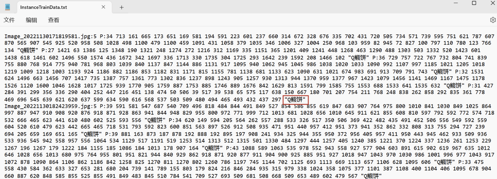
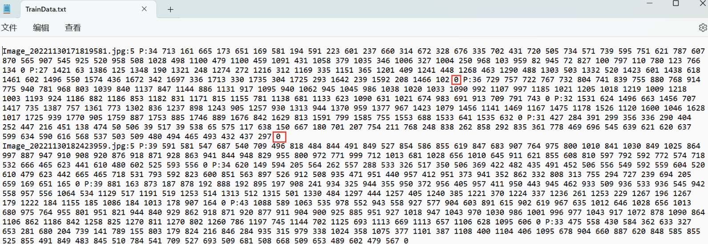

### 2) 格式转换

将海康数据集格式 图片名称：目标数量 P：坐标点数量 x1，y1，x2，y2… “标签名称“ 拆分转换为yolo-seg格式 标签类别 归一化后的坐标点数量 x1，y1，x2，y2…
转换代码详见:split_convert.py
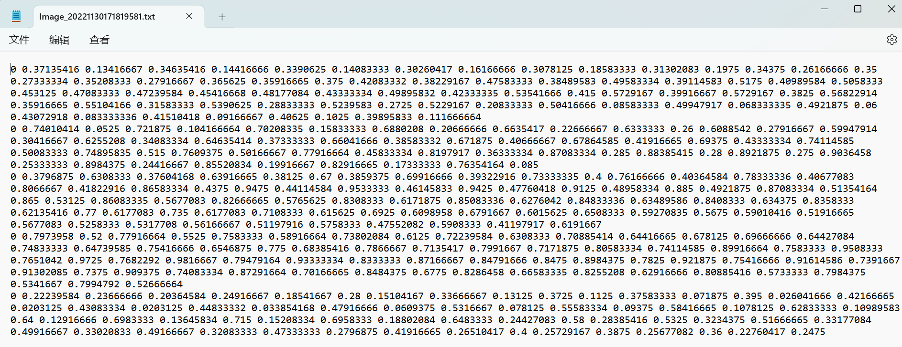

### 3) 格式检查

利用tensorboard检测训练数据格式是否正确：

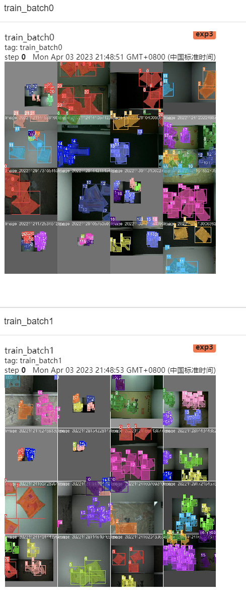

## 2、训练策略

根据综合考虑和赛道cpu推理，最终选择yolov5最终版v7.0做实例分割。预训练模型选择yolov5s-seg。首先，在训练之前，我们将训练集进行划分训练集：测试集为9:1。

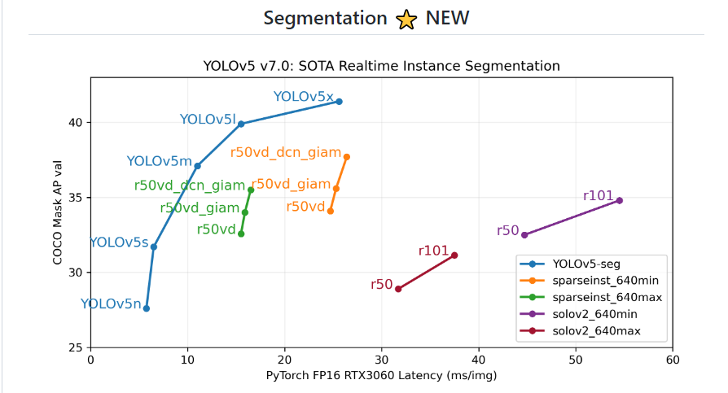

### 1) 训练前准备
提升精度：利用yolov5自带超参数搜索(遗传)，最后用搜索出的yaml文件进行训练，最终效果略微提升。

云服务器选择RTX2080Ti(11G,250W)进行300-500轮训练：

训练img_ize=480,防止cuda内存不够(默认640)

*--cache和编解码读取*最初直接采用yolov5训练，这种数据加载方式是以张为单位，基于像素的访问，但是训练时速度很慢，可能受其他线程影响造成的，大概一轮要40分钟左右。然后我们就尝试了cache这种方式，它是将所有训练数据存入到内存中，我们以6406403的输入图像为例，占道数据总共有10147张，全部读进去大约占11.6G的内存，平台是提供11G的内存，内存不够，也会导致训练变慢；于是尝试改进训练读取数据方式，采用的是cache+图像编解码的方式，内存占用仅是cache的1/6，由于添加了编解码，速度比cache慢点，但从数据比较来看，相差无几。这样既能节省内存又能加快训练速度。节省了我们训练过程的极力值和加快实验的步伐，训练时间缩小了将近10倍！！！编解码节省的内存还可以适当加大batch_size通过更多的轮数增加迭代效果
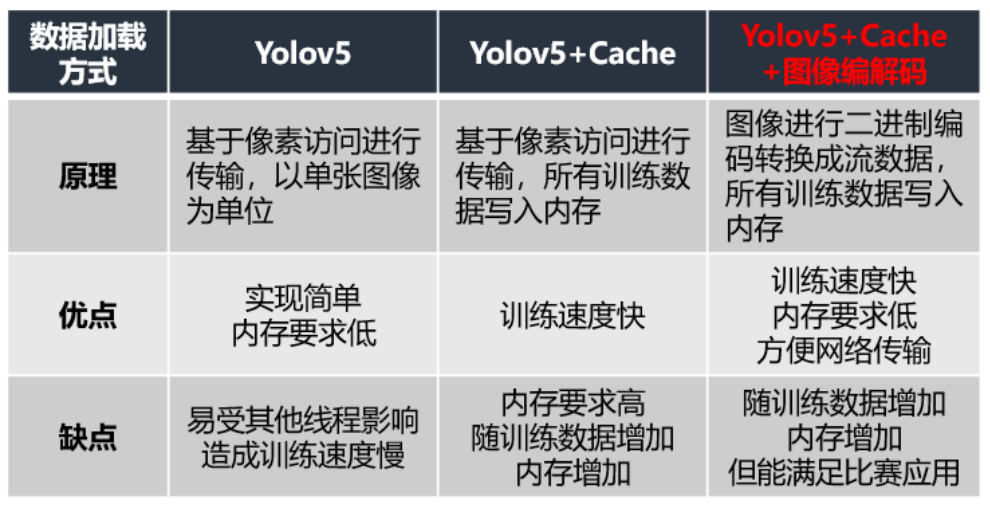

*Varifocal Loss损失函数*  
Varifocal Loss主要训练密集目标检测器使IOU感知的分类得分（IASC）回归，来提高检测精度。而目标遮挡是密集目标的特征之一，因此尝试使用该loss来缓解目标遮挡造成漏检现象。并且与focal loss不同，varifocal loss是不对称对待正负样本所带来的损失。
效果：但最终测试精度大大下降！！！分析：虽然样本存在少量不均匀，但不均匀的测试样本实在太少，所以提升不均匀样本精度的同时主要部分标签的测试精度下降很多，可能在密集数据集中效果不错，最终弃用!   

*SAM优化器：*    
SAM优化器可使损失值和损失锐度同时最小化，并可以改善各种基准数据集（例如CIFAR-f10、100g，ImageNet，微调任务）和模型的模型泛化能力，从而产生了多种最新性能。另外， SAM优化器具有固有的鲁棒性。添加调试成功之后发现精度只提升了0.2个点，且训练时间多了2倍，于是弃用！

*EIou损失函数：*
使用EIou替换CIoU加快模型收敛

### 2) 从py测试代码改进

主要修改img、conf_thres、iou_thres这几项参数,imgsz尺寸过大严重影响运算时间,可以自己调整正常训练的640,以及480,为了fps更高也可以480-32*N,当然fps快了,模型精度也是会下降的。最终反复测试，选择了img=320，fps明显提升，精度也提升了3个点。conf_thres和iou_thres阈值,自己经验是由小往大慢慢调试。最终py文件将pt模型转成onnx测试,测试时间明显缩短(cpu)。   
pt:
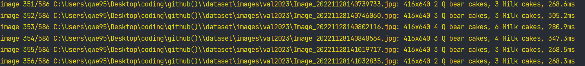
onnx:
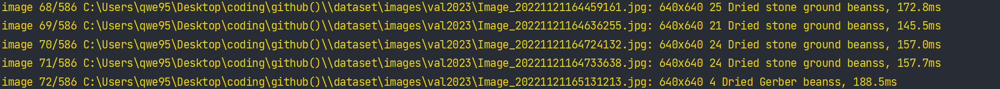

### 3) 从训练超参数改进

*数增强策略*:从数据角度，通过粘贴、裁剪、mosaic、仿射变换、颜色空间转换等对样本进行增强，增加目标多样性，以提升模型的检测与分类精度。

*训练结束通过查看tensorboard* 的metrics可以知道lr的是否过大,如果学习率过大容易导致loss下不去。(主要是上下波动频率大,不要在意数值)，P精确率在上下震荡中,就说明lr 学习率就过大了,可以适当调小学习率。
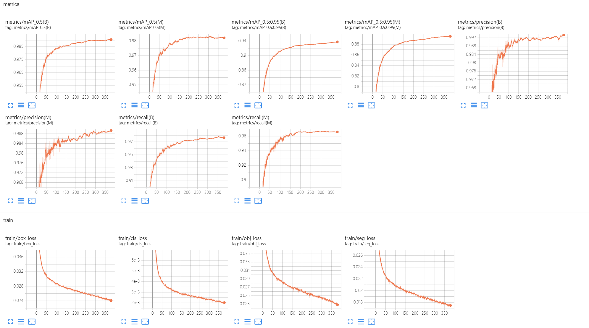

**冻结训练：**
在训练过程中采取常规训练与冻结训练想相结合的方式迭代，进一步抑制训练过程中容易出现的过拟合现象，具体训练方案是：1）常规训练；2）加入冻结模块的分步训练

第一步：随机利用一半数据进行yolov5常规训练，该过程中所有的参数是同时更新；
第二步：随机利用一半数据将常规pt进行freeze：冻结模块的特点就是将backbone和head轮流冻结，每epoch只更新未冻结部分的参数。我们以5个epoch为一个阶段，第一个epoch为head冻结，只训练backbone；第2~5个epoch为backbone冻结，只训练head。这样轮流更新backbone和head的参数，
第三步：调小学习率，利用所有数据进行正常训练，具体过程如下：
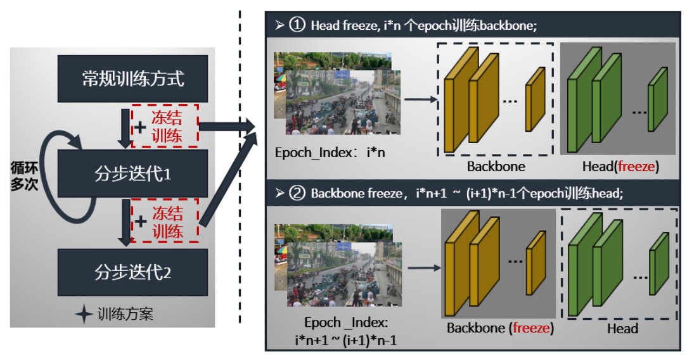

最终效果：测试精度和召回率再次上升！！！   
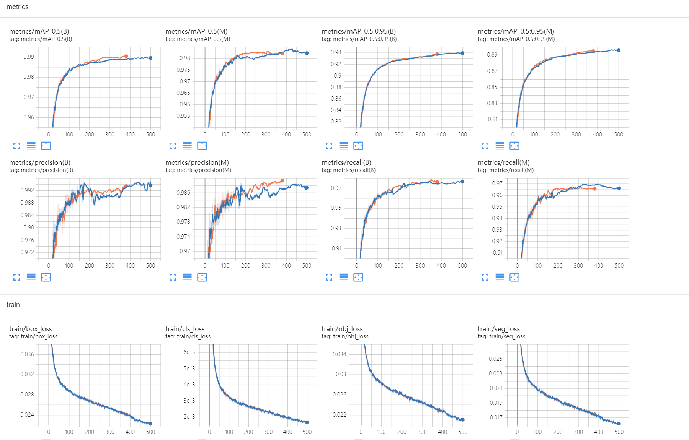
*ps：如果还想提升一点精度，可以把之前的sam优化加上，或者尝试其他的模型架构增加尺度之类*

# 算法类-物体实例分割算法(c++、xml推理集成VM)

## 1、推理API选择

经过调研yolo在cpu上的cpp推理速度对比：
| 速度(快->慢) | 
| -------- | 
| openvino | 
| onnxruntime| 
| libtorch | 
| dnn |

于是最终我选择了dnn和openvino两个版本进行推理和对比

### 1) dnn基础版本推理(intel-i7-12代:VM单张推理:时间283ms,内存利用率+3)

dnn(选择了框内mask检测提升推理速度),选择model文件夹下last.onnx模型；
基本界面展示：

基本交互功能展示：
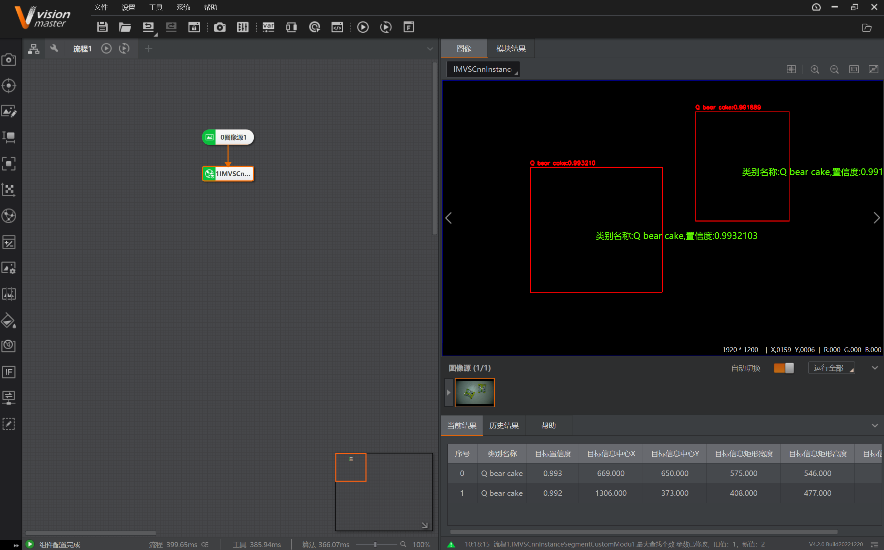
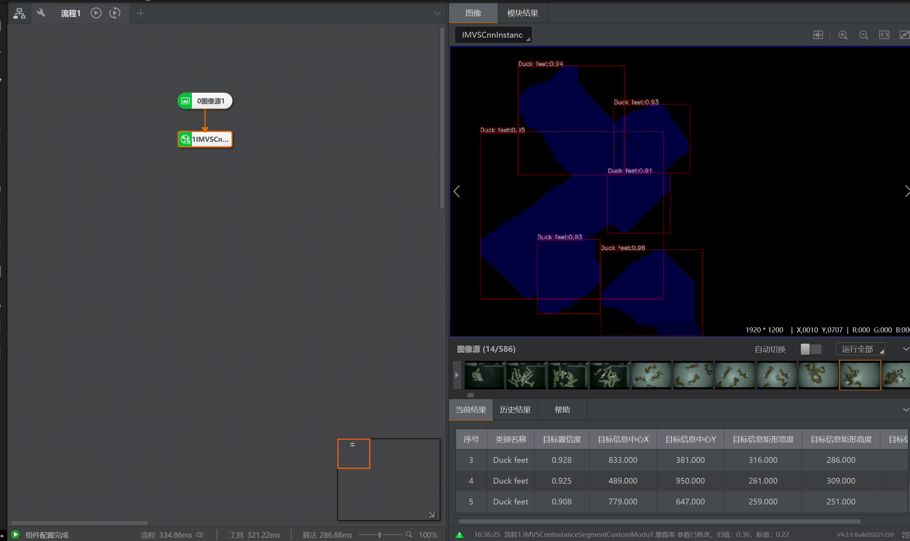
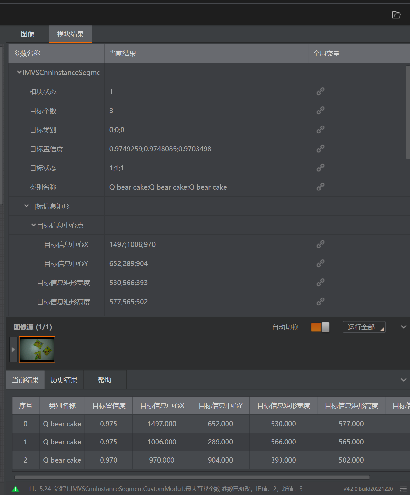
可实现多功能界面展示如：单一检测框展示，渲染mask展示，且可以和原始图像叠加显示不同的展示效果；当前结果和模块结果均对应正确(具体可见视频展示demo)

实现界面参数交互调整(具体可见下方openvino推理描述和视频展示demo)

### 2) openvino优化版本推理(intel-i7-12代:VM单张推理:时间303ms,内存利用率+5)

openvino选择model文件夹下last.xml文件进行推理(对于检测精度和推理时间均有明显提升！！！但openvino加速可能主要针对大尺寸图片提升明显,我将图片缩放成320x320后反而dnn推理速度更快)；

可实现多功能界面展示如：单一检测框展示，渲染mask展示，且可以和原始图像叠加显示不同的展示效果；当前结果和模块结果均对应正确(具体可见视频展示demo)

实现界面参数交互调整:主要实现运行参数的交互(具体可见视频展示demo)：   
1.  模型文件路径加载
2.  输出渲染使能按钮
3.  最大查找个数选择
4.  置信度选择
5.  nms重叠率选择   
6.  mask阈值选择
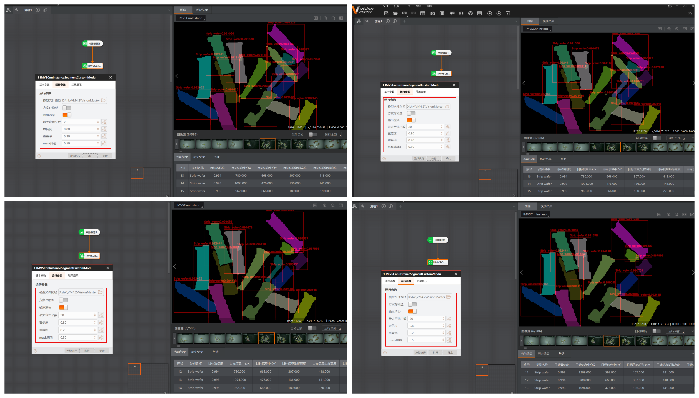

由于opencv没有集成，自行编写适用于cpp推理的softnms(详见openvino推理中soft_nms.h)；传统nms对于密集多重叠筛选会强行删除而永远筛选不到正确的个数，平滑筛选从而得到正确的个数）   
Soft NMS采用一种更为平滑的筛选规则，修正传统的NMS的暴力去除机制如下：
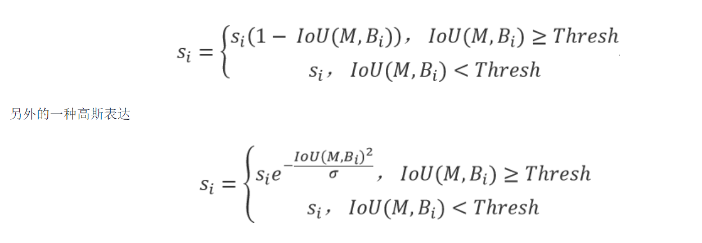

效果展示：
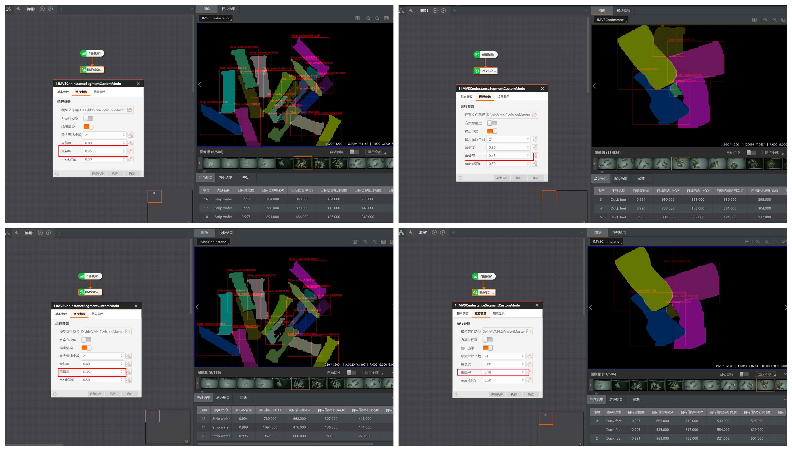

*当nms筛选也不行的时候配合最大查找个数可以完全实现精准查找！！！*

### 3) 遇到的一些问题和解决方案

1.  代理崩溃：指针存储的渲染图像不能随意释放！
2.  多次执行叠加显示：每次初始化都释放vector存储避免多次执行导致的bug！
3.  界面交互选择2位小数就崩溃：GetParam接口空间分配不够！
4.  其余：略

### 4) 功能完善和多边形顶点轮廓提取
功能完善：

1.  添加输出渲染使能！
2.  未加载模型报错！(*opencv不支持中文路径！*)
3.  加载图像格式报错!(模型RGB输入固定，如果想灰度图输入也行可以在后处理判断将灰度图转成RGB在输入模型推理，取消dnn推理cpp代码中的输入灰度图注释代码即可)

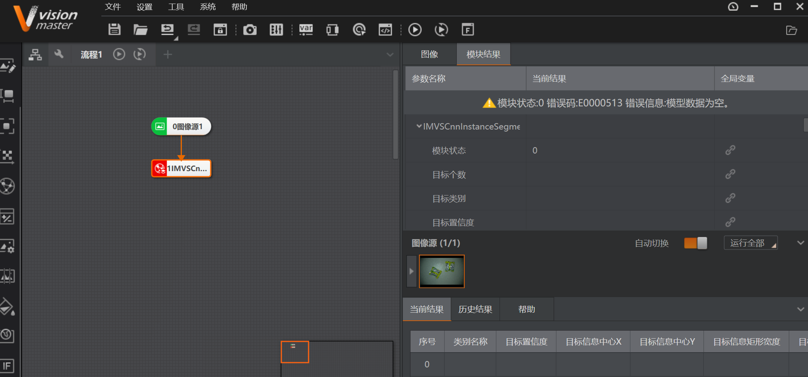
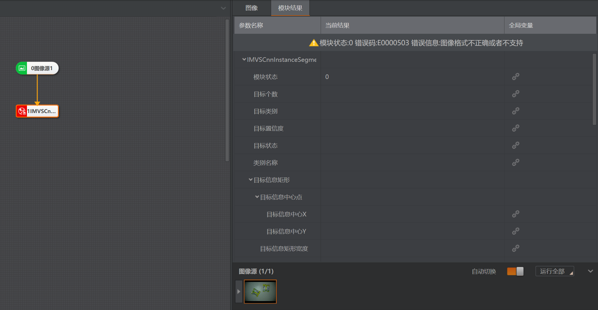

多边形顶点轮廓提取：   

多边形轮廓提取完成(取消dnn推理cpp代码中的轮廓提取注释代码即可)，但是运行时间加长，展示demo中没有添加；

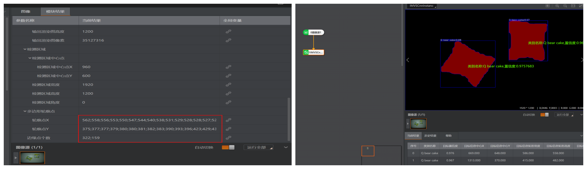